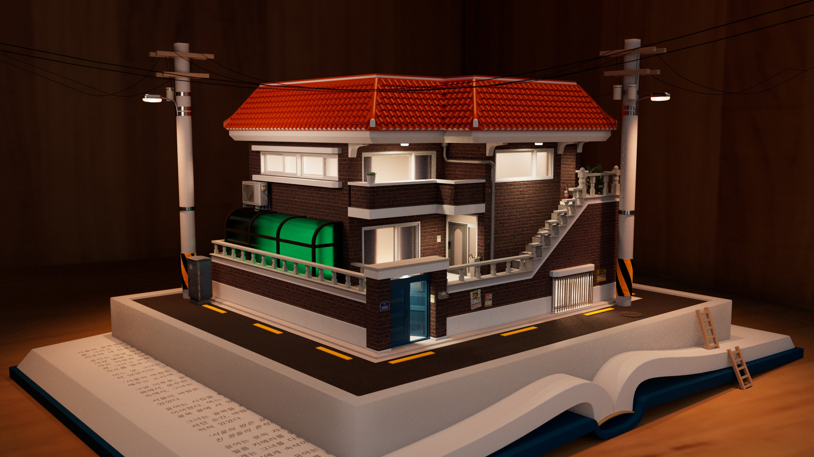
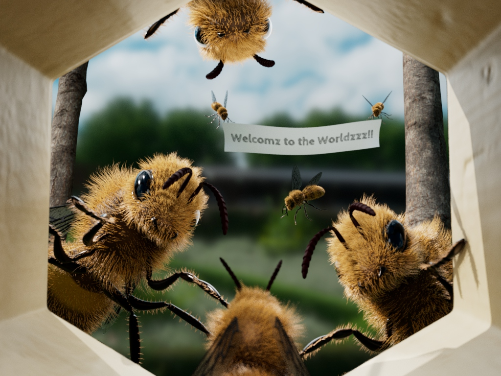

<!-- Header -->
<h1 align="center">🎨 Minjoong Kim — Portfolio</h1>

---

<table>
  <tr>
    <td width="220" align="center">
      
    </td>
    <td style="vertical-align: top; padding-left: 20px;">

Hello! I’m **Minjoong Kim**, currently studying **Computer Science (Games & Animation Emphasis)** at **Brigham Young University (BYU)**.  

Growing up, I always loved art. After winning a small award in an elementary school art contest, I began to value things that look and sound beautiful.  
That love for aesthetics naturally led me to fall in love not only with playing games but also with everything that makes them immersive—**visual design, background music, and storytelling**.  
I also adore **musicals** and **animation**, especially **musical animation**.

That’s why I chose to major in **CS Animation at BYU**.  
This page is a collection of my personal works and creative projects. I hope you enjoy browsing!

> **Tools:** Autodesk Maya | Substance Painter
  </tr>
</table>

---

## Works

### 🎉 Project 1  |  *Where the Gaze Lands*

> *“Our eyes follow our hearts.”*

This was my very first modeling project created in Maya — my first encounter with 3D art.  
At that time, my third sister got married, and I wanted to make something to celebrate her wedding.

When a father walks his daughter down the aisle, countless emotions must cross his mind.  
He blesses her happiness while realizing that he is no longer her strongest protector.  
In that moment, he might feel a quiet sense of loss or emotions too deep to describe.  
I wanted to capture that fragile yet profound moment.

This piece depicts **three figures** — the bride, the groom, and the bride’s father.  
While the father’s and groom’s gazes are clearly directed, **the bride’s gaze is intentionally left unseen**.  
Because where we look often reveals where our heart truly belongs.  

So, **whom is the bride looking at?**

---

### 🏠 Project 2  |  *Untitled (Red Brick House)*

> *“Every home holds a story — even the ones we only dream about.”*

When I was a child, the neighborhood I grew up in was filled with **red brick houses**.  
They stood along narrow alleyways — unorganized, yet full of warmth and familiarity.  
My family moved frequently when I was young. We never owned a house.  
(Thankfully, we’ve now settled down in one place.)  

As a child, I didn’t like moving all the time.  
I often wished that one of those red brick houses could be *ours*.  
So, in this work, I recreated that *imaginary home* from my childhood.

Since the streetlights are on, it must be evening.  
This house belongs to **three families** — one in the basement, one on the first floor, and one on the second.  
All the windows are lit, which makes me imagine that each family is enjoying dinner together tonight.

Even a single image can hold countless stories.  
That’s why I placed this house on top of an open book —  
to make it look as if this peaceful scene belongs to a story yet to be told.

What kind of lives might these three families be living inside this book?

---

### 🐝 Project 3  |  *First Flight*

> *“The world waits for those who dare to fly.”*

This project is one of my personal favorites. It was quite challenging to express the tiny hairs on the bee’s body, but I’m quite satisfied with how it turned out.

We all have our **first steps** moments filled with both excitement and fear such as our first day at school or our first leap into something new.  
(Though, of course, none of us remember the day we were born.)

I wanted to express that thrilling feeling of a beginning through **bees**.  
What might a young bee feel as it leaves its hive for the first time?  
Perhaps the older bees welcome the newcomers  
sometimes gently, sometimes sternly preparing them for the challenges of the world outside.

To me, the adult bees watching the baby bee resemble **my four older sisters**.  
I imagine they must have looked at me the same way when I was newly born into this world.

What kind of experiences will this young bee encounter?  
I hope it reaches the flower safely.

---

### ☎️ Project 4 | Korean Phone Booth

“Small acts, when multiplied by millions of people, can transform the world.”
 - Howard Zinn

I grew up in South Korea, and I do not know much about public phone booth outside of Korea, but there is one thing I vividly remember about the old public phone booths from my childhood.

Sometimes, the receiver was not properly hung up, resting instead on top of the phone booth.
And occasionally, there would be a small coin left behind such as a 10-won coin, worth only a few cents in U.S. currency.
This was not a mistake. It was a quiet act of consideration.
The remaining call time or spare change was intentionally left for the next person.

Today, not only in Korea but around the world, conflict, misunderstanding, and division continue to grow.
In a world that often feels harsh and distant, I wanted to express the idea of small, human kindness through this old public phone booth.

The receiver left on top of the booth invites curiosity.
Who was the last person using this phone?
What kind of conversation were they having before they left?

The booth is covered with traces of time, scratched surfaces, and other subtle signs of use.
Each mark hints at a story that once passed through this place.

Through this piece, I hope viewers pause for a moment and reflect.
What stories do these traces tell you?
And how might a small act of care quietly connect one stranger to another?

---

## Contact

- 🔗 **LinkedIn:** [www.linkedin.com/in/minjoong](https://www.linkedin.com/in/minjoong)  
- 📧 **School Email:** mj0908@byu.edu  
- 📮 **Personal Email:** minjoongkim98@gmail.com  

---

> © **Minjoong Kim**  
> All images, models, and assets in this repository are my original work unless noted.  
> Please do not reuse without permission.
